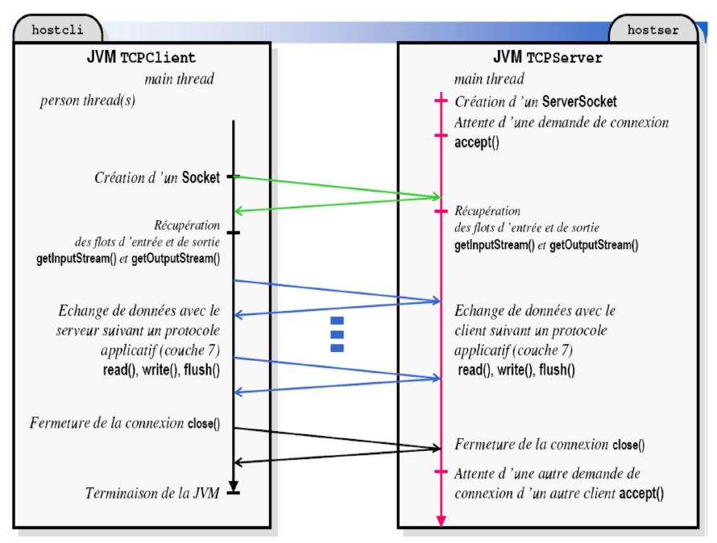

# Socket TCP simple connexion


## Implementation





## Server side

```java
import java.io.IOException;
import java.io.InputStream;
import java.io.OutputStream;
import java.net.ServerSocket;
import java.net.Socket;

public class Serveur {

	public static void main(String[] args) {

		try {
			ServerSocket ss = new ServerSocket(234) ;
			System.out.println("J'attends une connection");
			Socket s=ss.accept() ; 
			InputStream is= s.getInputStream();  // ouvre canal reception
			OutputStream os = s.getOutputStream();  // ouvre canal transmission
		
			System.out.println("J'attends un nombre");
			int nb=is.read();  // attends un message du client
			int rep=nb*2;
			
			os.write(rep);  // envoi un messsage au client
			System.out.println("fermeture de la connexion");
			s.close();
			
		} catch (IOException e) {
			// TODO Auto-generated catch block
			e.printStackTrace();
		} 			
	}
}
```

## Client side

```java
import java.io.IOException;
import java.io.InputStream;
import java.io.OutputStream;
import java.net.ServerSocket;
import java.net.Socket;
import java.util.Scanner;

public class Client {

	public static void main(String[] args) {
		// TODO Auto-generated method stub

		try {
			Socket s= new  Socket("localhost",234); 
			InputStream is= s.getInputStream();  // ouvre canal reception
			OutputStream os = s.getOutputStream();  // ouvre canal transmission

			Scanner clavier = new Scanner(System.in);
			System.out.println("saisir un nombre");
			
			int nb = clavier.nextInt();
			os.write(nb); int reponseServer=is.read();
			
			System.out.println("Reponse: "+ reponseServer);

			os.write(reponseServer);  // envoi un messsage au client
			s.close();
			
		} catch (IOException e) {
			// TODO Auto-generated catch block
			e.printStackTrace();
		} 	
	}
}
```